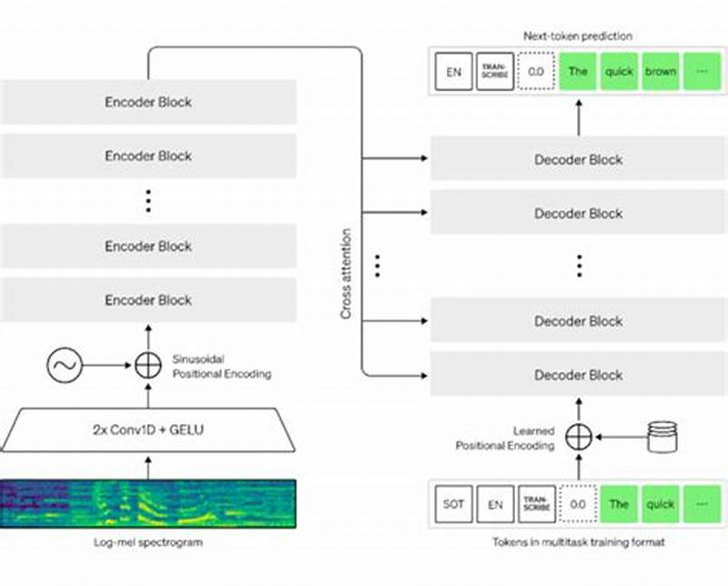
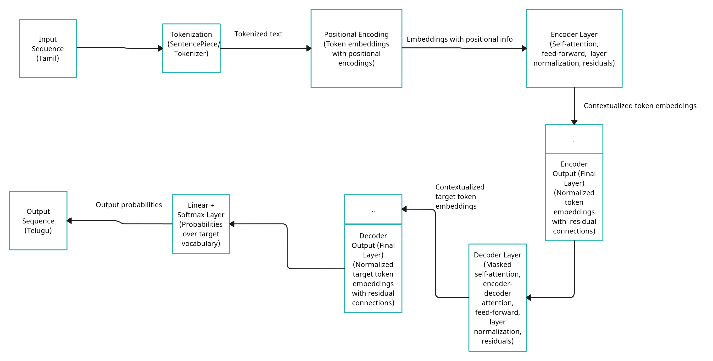
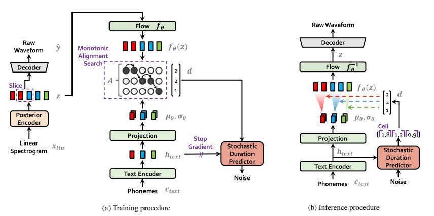
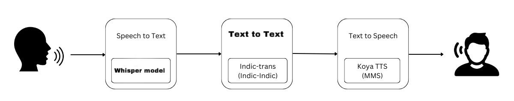

# Tamil-to-Telugu Speech-to-Speech Translation for Multilingual Communication

## Authors
1. K. Praneetha, Amrita Vishwa Vidyapeetham, Coimbatore, India
2. K. Mugunthan, Amrita Vishwa Vidyapeetham, Coimbatore, India
3. Voruvuru Sisir Kausthubh, Amrita Vishwa Vidyapeetham, Coimbatore, India
4. M. Vignesh, Amrita Vishwa Vidyapeetham, Coimbatore, India

## Abstract
The growing demand for effective cross-lingual communication highlights the importance of speech-to-speech (S2S) translation technologies. These systems have enormous promise, especially in multilingual countries like India, which has 22 official languages, including Tamil and Telugu. This project focuses on developing a Tamil-to-Telugu S2S translation model that includes three key components: Speech-to-Text (STT), Text Translation (TT), and Text-to-Speech (TTS) modules.

## Methodology
### Speech-to-Text (STT)

### Text Translation (TT)

### Text-to-Speech (TTS)

## Pipeline

## Results
### Speech-to-Text (STT) Results

### Text Translation (TT) Results

### Text-to-Speech (TTS) Results

## Conclusion
The development of a robust Tamil-to-Telugu Speech-to-Speech (S2S) translation system has shown significant promise in overcoming language barriers and facilitating effective multilingual communication. By leveraging the Whisper ASR model for Speech-to-Text (STT), we achieved a notable reduction in Word Error Rate (WER), demonstrating the model's efficiency in handling Tamil speech inputs. The transformer-based Text Translation (TT) model ensured accurate and contextually appropriate translations from Tamil to Telugu, achieving a high BLEU score of 0.57 and a Cosine Similarity of 0.69597. The final Text-to-Speech (TTS) phase, utilizing the VITS-based MMS model, produced natural and intelligible Telugu speech, closely approximating human speech quality with a MOS score of 4.43.

This integrated S2S translation pipeline represents a significant advancement in the field of low-resource language processing, particularly for Dravidian languages. The system's ability to handle noisy environments and maintain high accuracy across all translation phases highlights its potential for real-world applications. Future work will focus on further refining the translation models, expanding the dataset to include more diverse speech samples, and exploring end-to-end S2S translation approaches to enhance system efficiency and performance.

Our research underscores the importance of continuous innovation and adaptation of state-of-the-art technologies to address the unique challenges posed by multilingual communication in diverse linguistic landscapes. By enhancing the accessibility and usability of S2S systems, we aim to contribute to a more inclusive and connected world, where language differences no longer impede effective communication.
